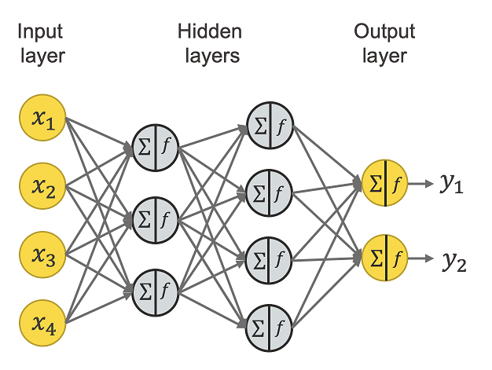
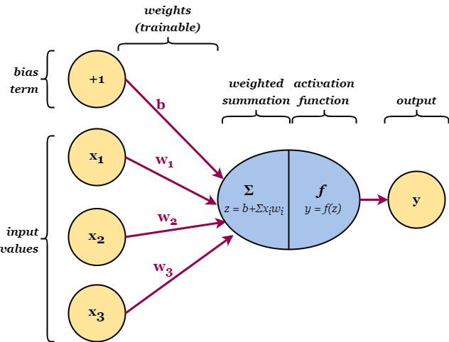
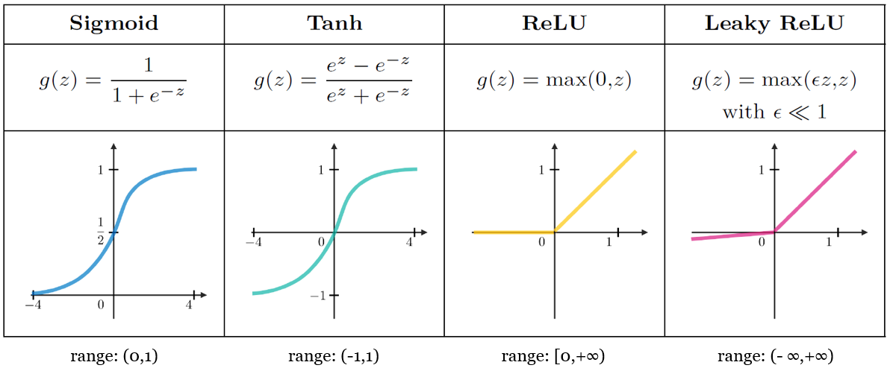

# Feed-forward Neural Network

Neural network = a network of small computing units, each of which takes a vector of input values and produces a single output value

## Architecture

## Neural Unit
 Single compositional unit:
 *   takes an input vector: $$\mathbf{x} = [x_1, x_2, ... , x_n] $$
 *   computes its weighted sum: $$z = b + \\sum_{i=1}^nw_ix_i  $$
    Vector notation: $$z = \mathbf{w}\cdot\mathbf{x} + b$$
 *   applies a non-linear function to produce an output: $$y = f(z)$$

## Activation function

Function applied at the end of the hidden unit. It introduces non-linear complexities to the model.

*   **Vanishing gradient problem**: gradients close to 0 cause the error signal to get smaller until it's too small to be used for training. It happens with sigmoid and tanh functions: very high $z$ => saturated $y$ (close to 1) => derivative close to 0

## Forward Propagation

>$\text{for } i \text{ in } 1,...,n:$
>>$\mathbf{z}^{[i]} = \mathbf{W}^{[i]} \cdot \mathbf{a}^{[i-1]} + \mathbf{b}^{[i]}$
>>
>>$\mathbf{a}^{[i]} = f^{[i]}(\mathbf{z}^{[i]})$
>>
>$\mathbf{\hat{y}} = \mathbf{a}^{[n]}$

*   $\mathbf{W}^{[i]}$: weights matrix for layer $i$
*   $\mathbf{a}^{[0]}$: input vector
*   $\mathbf{a}^{[i]}$: input vector for layer $i$
*   $\mathbf{b}^{[i]}$: bias' term weight for layer $i$
*   $\mathbf{z}^{[i]}$: weighted summation for layer $i$
*   $f^{[i]}$: activation funtion for layer $i$:
    *   Tanh or ReLU for Hidden Layers
    *   Softmax or Sigmoid for Output Layer
*   $\mathbf{\hat{y}}$: output vector
*   $n$: number of layers

**Vectorized version:**

>$\text{for } i \text{ in } 1,...,n:$
>>$\mathbf{Z}^{[i]} = \mathbf{A}^{[i-1]} \cdot \mathbf{W}^{[i]T}   + \mathbf{b}^{[i]}$
>>
>>$\mathbf{H}^{[i]} = f^{[i]}(\mathbf{Z}^{[i]})$
>>
>$\mathbf{\hat{y}} = \mathbf{H}^{[n]}$

## Loss Function

Models the distance between the sistem output $\mathbf{\hat{y}}$ and the gold output $\mathbf{y}$

**Binary Cross-Entropy Loss**

$$ L(\hat{y}, y) = -\log p(y|x) = - [y\log \hat{y} + (1-y) \log (1 - \hat{y})]$$

**Cross-Entropy Loss**

$$ L(\mathbf{\hat{y}}, \mathbf{y}) = -\sum_{k=1}^K \mathbf{y}_k \log \mathbf{\hat{y}}_k $$

## Backpropagation

To find the parameters that minimize the loss function,
we use the **gradient descent** optimization algorithm. \
It computes the partial derivative of the loss function 
with respect to each of the input variables.\
The derivative $\frac{\partial L}{\partial w}$ 
tells us how much of a small change in $w$ affects $L$. 
Backwards differentiation makes use \
of the **chain rule** to calculate the partial derivative of a composite function $L(w) = L(a(z(w)))$:

$$\frac{\partial L}{\partial w}=\frac{\partial L}{\partial a}\cdot \frac{\partial a}{\partial z} \cdot \frac{\partial z}{\partial w}$$

The weight is updated as follows:

$$w \leftarrow w - \alpha\frac{\partial L}{\partial w} $$

## Training Loop:

The goal of training a NN is to learn the parameters $\mathbf{W}^{[i]}$ and  $\mathbf{b}^{[i]}$ 

that minimize $L(\mathbf{\hat{y}}, \mathbf{y})$:
*    Step 1: Forward propagation on training data
*    Step 2: Loss calculation
*    Step 3: Backpropagate loss to get the gradients
*    Step 4: Use gradients to update weights
